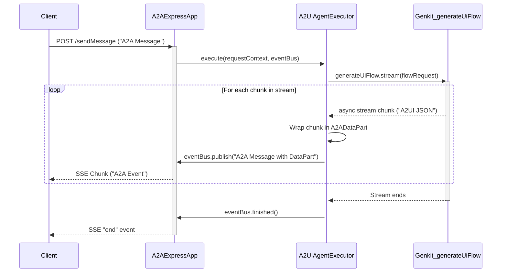

# Modification Design: A2A Protocol Integration for a2ui_server

## 1. Overview

This document outlines the design for refactoring the `a2ui_server` package to replace its direct Genkit flow endpoint with a standards-compliant Agent-to-Agent (A2A) protocol server. The current implementation uses a Genkit flow to generate and serve an A2UI stream directly over HTTP, which is not interoperable with standard A2A clients.

The goal is to create a proper A2A agent that advertises its UI generation capabilities via an Agent Card and communicates using the `a2a-js` library. The agent will still leverage the power of the existing Genkit flow internally to generate the A2UI protocol stream, but it will wrap this functionality within the A2A protocol structure. This change will make the server compatible with any A2A client, such as the `a2ui_client` in this repository.

## 2. Analysis of the Goal

The core problem with the current `a2ui_server` is its non-standard communication protocol. It exposes a Genkit flow directly, which couples the client to a specific Genkit implementation. The A2A protocol is designed to solve this by providing a standardized, framework-agnostic way for AI agents to communicate.

By adopting A2A, we gain:

- **Interoperability:** Any A2A-compliant client can discover and interact with our agent.
- **Standardization:** We adhere to an open standard for agent communication, promoting a healthier ecosystem.
- **Clear Separation of Concerns:** The `a2a-js` library handles the protocol's boilerplate (Agent Card serving, task management, event streaming), allowing our application code to focus on the core logic of UI generation.

The key components from the `a2a-js` library that we will use are:

- **`A2AExpressApp`**: To quickly set up an Express.js application that handles the A2A JSON-RPC 2.0 endpoints.
- **`AgentCard`**: To define and serve the agent's capabilities, including the crucial A2UI extension that signals its ability to generate UI streams.
- **`AgentExecutor`**: An interface we will implement to contain our business logic. This is where we will bridge the A2A server with our Genkit flow.
- **`ExecutionEventBus`**: Provided to the `AgentExecutor`, this is the mechanism for sending streaming data (like UI updates) back to the client.
- **`DefaultRequestHandler`**: A class that wires together the agent card, task store, and our executor to handle incoming A2A requests.

## 3. Alternatives Considered

### 1. Modify Genkit Flow to Manually Implement A2A

We could have modified the existing Genkit flow to manually construct and return JSON objects that conform to the A2A specification.

- **Downside:** This would be a significant effort, requiring us to re-implement much of the logic already provided by the `a2a-js` library, such as serving the Agent Card, handling task lifecycle events, and managing streaming connections. It would be brittle and prone to errors.

### 2. Use a Different Agent Framework

We could have abandoned Genkit in favor of another framework that might have more native A2A support.

- **Downside:** This would require a complete rewrite of the UI generation logic, which is already working correctly within the `generateUiFlow`. The goal is to change the communication protocol, not the core generation logic.

The chosen approach of wrapping the existing Genkit flow with an `a2a-js` server is the most efficient and robust solution, as it leverages the strengths of both libraries.

## 4. Detailed Design

### 4.1. Project Structure and File Modifications

The `a2ui_server/src` directory will be modified as follows:

- **`index.ts`**: This file will be modified to initialize and run the new `A2AExpressApp` instead of the Genkit flow server.
- **`a2a.ts` (New File)**: This file will contain the core A2A server setup, including the `AgentCard` definition, the `A2UIAgentExecutor` implementation, and the instantiation of the `DefaultRequestHandler`.
- **`generate.ts`**: The `generateUiFlow` will be slightly modified. It will no longer be exposed directly as an HTTP endpoint. Instead, it will be an internal function that can be called by our `A2UIAgentExecutor`. The `streamingCallback` will be removed in favor of returning the stream directly.
- **`genkit.ts`**: No significant changes are expected here.
- **`schemas.ts`**: No changes are expected here.

### 4.2. A2A Server Setup (`index.ts` and `a2a.ts`)

In `index.ts`, we will replace the Genkit server startup with the Express server startup.

```typescript
// src/index.ts
import express from "express";
import { a2aApp } from "./a2a";

const port = process.env.PORT || 10002;
const app = express();

// Mount the A2A routes
app.use(a2aApp);

app.listen(port, () => {
  console.log(`🚀 A2A Server started on http://localhost:${port}`);
});
```

The main logic will reside in `a2a.ts`.

```typescript
// src/a2a.ts
import express from "express";
import { v4 as uuidv4 } from "uuid";
import {
  AgentCard,
  AgentExecutor,
  RequestContext,
  ExecutionEventBus,
  DefaultRequestHandler,
  InMemoryTaskStore,
  A2AExpressApp,
  A2ADataPart,
} from "@a2a-js/sdk/server";
import { generateUiFlow } from "./generate"; // We'll call our existing flow

// 1. Define the Agent Card
const a2uiAgentCard: AgentCard = {
  name: "A2UI Genkit Server",
  description: "An agent that generates UIs using the A2UI protocol.",
  protocolVersion: "0.3.0",
  version: "1.0.0",
  url: "http://localhost:10002/", // This needs to be publicly accessible in production
  skills: [
    {
      id: "a2ui-chat",
      name: "A2UI Chat",
      description: "Generates a UI based on a chat conversation.",
    },
  ],
  extensions: ["https://github.com/a2aproject/a2a-samples/extensions/a2ui/v7"],
};

// 2. Implement the AgentExecutor
class A2UIAgentExecutor implements AgentExecutor {
  async execute(
    requestContext: RequestContext,
    eventBus: ExecutionEventBus
  ): Promise<void> {
    const { message, taskId, contextId } = requestContext;

    // Extract the text prompt from the incoming message
    const userPrompt = message.parts
      .filter((part) => part.kind === "text")
      .map((part) => (part as any).text)
      .join("\n");

    if (!userPrompt) {
      eventBus.finished();
      return;
    }

    // TODO: We need to adapt the `generateUiFlow` to accept a simpler input
    // and to handle conversation history. For now, we'll just pass the prompt.
    const flowRequest = {
      // This needs to be adapted based on how we manage the catalog.
      // For now, we'll assume a static or default catalog.
      catalog: { type: "object", properties: {} },
      conversation: [
        {
          role: "user",
          parts: [{ type: "text", text: userPrompt }],
        },
      ],
    };

    try {
      // Call the Genkit flow and get the stream
      const { stream } = generateUiFlow.stream(flowRequest);

      // Process the stream from the Genkit flow
      for await (const chunk of stream) {
        // Wrap the A2UI message in an A2A DataPart
        const dataPart: A2ADataPart = {
          kind: "data",
          data: { a2uiMessages: [chunk] },
        };

        // Publish the data part on the event bus
        eventBus.publish({
          kind: "message",
          messageId: uuidv4(),
          role: "agent",
          parts: [dataPart],
          contextId: contextId,
          referenceTaskIds: [taskId],
        });
      }
    } catch (error) {
      console.error("Error executing Genkit flow:", error);
      // Optionally publish an error message back to the client
    } finally {
      // Signal that the task is finished
      eventBus.finished();
    }
  }

  async cancelTask(taskId: string, eventBus: ExecutionEventBus): Promise<void> {
    // Genkit flows can be cancelled, we would need to implement this.
    console.log(`Cancellation requested for task: ${taskId}`);
    eventBus.finished();
  }
}

// 3. Set up the A2A Express App
const agentExecutor = new A2UIAgentExecutor();
const requestHandler = new DefaultRequestHandler(
  a2uiAgentCard,
  new InMemoryTaskStore(),
  agentExecutor
);
const appBuilder = new A2AExpressApp(requestHandler);
export const a2aApp = appBuilder.setupRoutes(express.Router());
```

### 4.3. `generateUiFlow` Adaptation

The `generateUiFlow` in `src/generate.ts` will be modified to remove the `streamingCallback` and instead return the stream. It will no longer be an exposed flow but an internal function.

```typescript
// src/generate.ts (Modified)
// ... imports ...

// This is no longer a `defineFlow` but a regular async generator function
export async function* generateUiStream(request: GenerateUiRequest) {
  // ... (existing logic for setting up system prompt and conversation)

  const { stream } = ai.generateStream({
    model: googleAI.model("gemini-1.5-pro"),
    system: systemPrompt,
    messages: genkitConversation,
    tools: [updateSurfaceTool, deleteSurfaceTool],
  });

  for await (const chunk of stream) {
    if (chunk.toolRequests) {
      for (const toolRequest of chunk.toolRequests) {
        if (toolRequest.toolRequest.name === "updateSurface") {
          const { surfaceId, definition } = toolRequest.toolRequest
            .input as UpdateSurfaceInput;
          const { root, widgets } = definition;
          yield {
            surfaceUpdate: {
              surfaceId,
              components: widgets,
            },
          };
          yield {
            beginRendering: {
              surfaceId,
              root,
            },
          };
        } else if (toolRequest.toolRequest.name === "deleteSurface") {
          const { surfaceId } = toolRequest.toolRequest
            .input as DeleteSurfaceInput;
          yield {
            deleteSurface: {
              surfaceId,
            },
          };
        }
      }
    }
  }
}

// The old `generateUiFlow` is removed or repurposed. For clarity, we'll define a new flow
// that calls this generator, though in our A2A design, the executor calls the generator directly.
export const generateUiFlow = ai.defineFlow(
  {
    name: "generateUi",
    inputSchema: generateUiRequestSchema,
    outputSchema: z.unknown(),
  },
  async (request, streamingCallback) => {
    if (!streamingCallback) {
      throw new Error("This flow must be called in a streaming fashion.");
    }
    for await (const chunk of generateUiStream(request)) {
      streamingCallback(chunk);
    }
  }
);
```

_Correction_: The `generateUiFlow` can remain a flow, and the `AgentExecutor` can call it using `generateUiFlow.stream()`. This is a cleaner integration. The `generateUiFlow` itself doesn't need to change significantly, as the `streamingCallback` is how `flow.stream()` provides chunks.

### 4.4. Data Flow Diagram

This diagram illustrates the new, end-to-end communication flow.



## 5. Summary

This design refactors the `a2ui_server` to be a standard A2A-compliant agent. It introduces the `a2a-js` library to handle the protocol details and creates an `A2UIAgentExecutor` to bridge the A2A server with the existing Genkit-based UI generation logic. The `generateUiFlow` remains largely unchanged, but its output stream is now consumed by the executor and relayed to the client over an A2A event stream. This approach maximizes code reuse while achieving the primary goal of protocol compliance and interoperability.

## 6. References

- [A2A Protocol GitHub Repository](https://github.com/a2aproject/A2A)
- [A2A Protocol Specification](https://raw.githubusercontent.com/a2aproject/A2A/refs/heads/main/README.md)
- [a2a-js SDK Repository](https://github.com/a2aproject/a2a-js)
- [Genkit Documentation](https://genkit.dev/docs)

```

```
