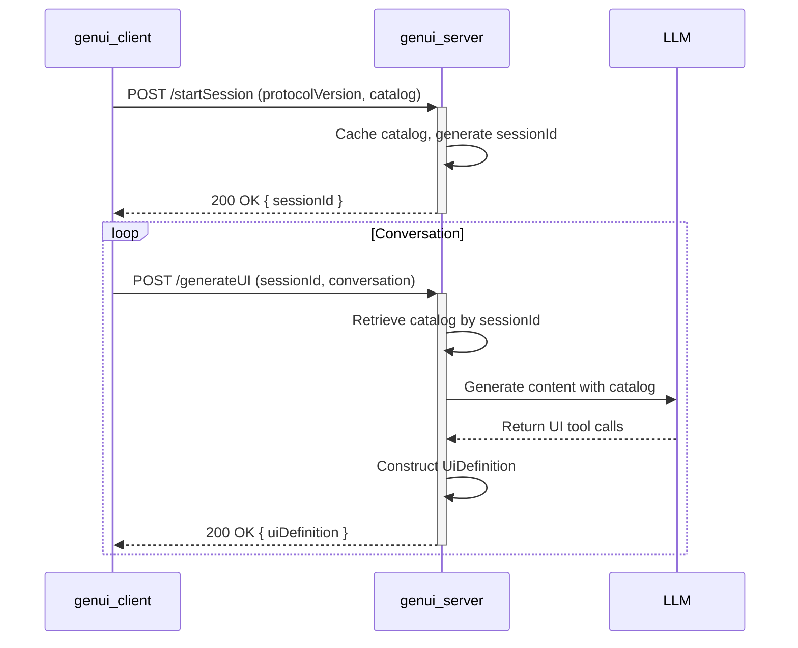

# Refactor Design: Splitting `flutter_genui` into Client and Server

## Overview

This document outlines the design for refactoring the `flutter_genui` package into a client-server architecture. The current package combines AI-driven UI generation and Flutter-based rendering into a single monolithic library. This refactor will separate these concerns into two distinct packages:

1. **`genui_server`**: A server-side component built with Genkit in TypeScript. It will be responsible for interacting with the Large Language Model (LLM) to generate UI definitions.
2. **`genui_client`**: A Flutter package responsible for communicating with the `genui_server`, receiving UI definitions, and rendering them using Flutter.

This separation will improve modularity, scalability, and maintainability. It will also allow for the UI generation logic to be updated and deployed independently of the client application.

## Detailed Analysis of the Goal

The primary goal is to decouple the UI generation logic from the UI rendering logic.

### Current Architecture Limitations

- **Monolithic Structure**: All logic is bundled into one Flutter package. Changes to the AI interaction logic require a new release of the Flutter app.
- **Language Constraint**: The entire system is written in Dart/Flutter, which may not be the optimal environment for server-side AI orchestration.
- **Scalability**: The current architecture is not designed for scalability. Each client runs its own UI generation, which is inefficient.
- **Security**: Embedding AI model access and system prompts directly in the client application poses a security risk.

### Desired Architecture Benefits

- **Separation of Concerns**: The client is only concerned with rendering, and the server is only concerned with generation.
- **Technology Fit**: Use TypeScript and Genkit for the server, which are well-suited for server-side development and AI orchestration. Use Flutter for what it excels at: building beautiful and performant UIs.
- **Scalability & Centralization**: The UI generation logic is centralized, making it easier to manage, update, and scale.
- **Improved Security**: API keys and sensitive prompts are kept on the server, not distributed in the client app.
- **Flexibility**: Other clients (e.g., web, other mobile frameworks) could potentially connect to the same `genui_server`.

## Alternatives Considered

### 1. Keep the Monolithic Flutter Package

- **Description**: Continue with the current architecture, where the Flutter app handles both UI generation and rendering.
- **Pros**:
  - No major refactoring required.
  - Simpler initial setup for new projects.
- **Cons**:
  - Does not address the limitations of scalability, security, and maintainability.
  - Tightly couples the UI to the AI logic.

### 2. Server-Side Dart

- **Description**: Create a server-side component using a Dart framework like Dart Frog or Shelf.
- **Pros**:
  - Allows for code sharing (e.g., data models) between the client and server.
  - The development team can stick to a single language.
- **Cons**:
  - The Dart server-side ecosystem is less mature than Node.js/TypeScript, especially for AI/ML orchestration. Genkit provides a robust, feature-rich environment specifically for this purpose.

The chosen client-server approach with a TypeScript-based Genkit server is the most robust and forward-looking solution.

## Detailed Design

### 1. Session Management and Protocol

To avoid sending the verbose widget catalog with every request, the client will initiate a session with the server.

- **Handshake**: The client will start by making a "handshake" request to an initialization endpoint on the server. This request will contain the client's protocol version and its widget catalog (serialized as a JSON schema).
- **Session ID**: The server will validate the request, cache the catalog, and return a unique `sessionId`.
- **Versioning**: The protocol version (e.g., `v1`) will be sent by the client. The server can check this version for compatibility and reject requests from outdated clients, ensuring backward compatibility can be managed gracefully.
- **State**: The server will store the catalog associated with the `sessionId`. This could be in an in-memory cache for simplicity or a more persistent store like Redis or Firestore for scalability.

### 2. `genui_server` (Genkit/TypeScript)

This package will be located in `packages/genui_server`.

#### Technology Stack

- **Framework**: [Genkit](https://firebase.google.com/docs/genkit)
- **Language**: TypeScript
- **Package Manager**: pnpm

#### API Endpoints

The server will expose two main endpoints:

1. **`startSession` (Flow)**:

   - **Request**: `{ protocolVersion: string, catalog: JSONSchema }`
   - **Action**: Caches the catalog, generates a `sessionId`.
   - **Response**: `{ sessionId: string }` or an error if the protocol version is incompatible.

2. **`generateUI` (Flow)**:
   - **Request**: `{ sessionId: string, conversation: ChatMessage[] }`
   - **Action**: Retrieves the catalog using the `sessionId`, interacts with the LLM to generate a UI definition.
   - **Response**: `{ uiDefinition: UiDefinition }`

### 3. `genui_client` (Flutter)

This package will be located in `packages/genui_client`.

#### Core Flutter Components

1. **`GenUIClient`**:

   - Will manage the `sessionId`.
   - **`startSession(Catalog catalog)`**: An initialization method to perform the handshake. It will be called once when the application starts. It will store the received `sessionId`.
   - **`generateUI(List<ChatMessage> conversation)`**: This method will now send the stored `sessionId` along with the conversation. It will also handle session expiry or errors, potentially by re-triggering the `startSession` handshake.

2. **UI Rendering Logic**:

   - The existing UI rendering logic from `flutter_genui` will be moved to this package. This includes `GenUiSurface`, `SurfaceManager`, `Catalog`, and the core widgets.

3. **`GenUiManager` Refactoring**:
   - The `GenUiManager` will be refactored to orchestrate the interaction with the `GenUIClient`. It will be responsible for ensuring a session is started before `generateUI` is called.

### 4. New `travel_app` Example

A new example application will be created by copying the existing `travel_app` to `packages/genui_client/example`. This new example will be updated to:

- Depend on `genui_client`.
- Initialize the `GenUiManager` and call a method to start the session during app startup.
- Use the `GenUiManager` to send conversation updates to the server and receive UI definitions in return.

## Summary of Design

The refactor will result in a clean separation of concerns. The client defines its UI capabilities and initiates a session with the server. Subsequent communication is lightweight, referencing the session. This architecture is efficient, scalable, secure, and maintainable.

## Research URLs

- **Genkit Documentation**: [https://firebase.google.com/docs/genkit](https://firebase.google.com/docs/genkit)
- **Zod (for schema definition)**: [https://zod.dev/](https://zod.dev/)
- **pnpm Package Manager**: [https://pnpm.io/](https://pnpm.io/)
