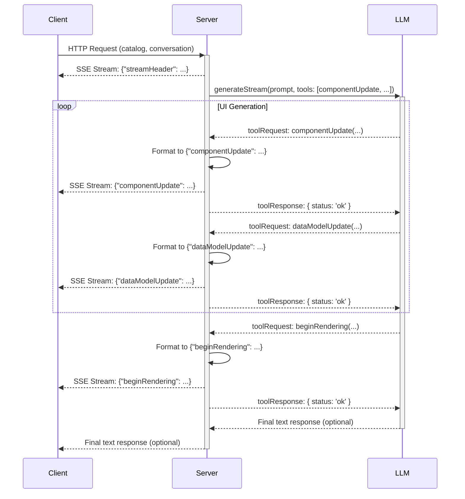

# Refactor Design Document: `genui_server` to GULF Protocol (Revised)

## 1. Overview

This document outlines the design for refactoring the `genui_server` package. The goal is to replace its current proprietary, tool-based UI generation mechanism with the standardized **GULF (Generative UI Language Format) Protocol**.

This revised design maintains the server's existing streaming and tool-calling architecture. Instead of generating a monolithic UI definition, the LLM will be equipped with tools that allow it to incrementally build the UI by emitting individual GULF protocol messages as JSONL strings. This approach preserves the progressive rendering capability, which is a core requirement.

## 2. Detailed Analysis of the Goal or Problem

### Current State

- **Protocol:** The server uses a custom protocol where the client receives a stream of Genkit `toolRequest` objects for tools like `addOrUpdateSurface`.
- **LLM Interaction:** The LLM acts as an agent that imperatively builds a UI by calling specific functions.
- **Limitations:** The protocol is bespoke and tightly couples the client and server. It is not a standardized, interoperable format.

### Target State

- **Protocol:** The server will produce a valid GULF JSONL stream.
- **LLM Interaction:** The LLM will still act as a tool-using agent. However, the tools will be redesigned to correspond to the messages of the GULF protocol. Instead of a high-level `addOrUpdateSurface` tool, the LLM will use lower-level tools like `componentUpdate` and `dataModelUpdate`.
- **Data Flow (GULF):**
  1.  Client sends a `catalog` (JSON Schema) and `conversation` history.
  2.  Server constructs a system prompt that teaches the LLM how to think in terms of the GULF protocol's declarative, adjacency-list model.
  3.  The prompt will also define a new set of tools (`componentUpdate`, `dataModelUpdate`, `beginRendering`) that the LLM can call.
  4.  The `gulfFlow` will stream the output of these tool calls, formatted as JSONL strings, directly to the client.
- **Benefit:** This approach adheres to the GULF standard while fully leveraging a streaming architecture to enable progressive UI rendering. It provides a clear, incremental path for the LLM to construct a complex UI.

## 3. Alternatives Considered

### Alternative 1: Monolithic JSON Generation (Rejected)

- **Description:** An initial design proposed having the LLM generate a single, large JSON object representing the entire UI, which the server would then serialize into a JSONL stream.
- **Pros:** Simpler logic for the LLM, as it only needs to produce one structured output.
- **Cons:** This was **rejected** as it fundamentally undermines the primary benefit of a streaming protocol. The client would have to wait for the entire UI to be generated before rendering anything, destroying the perception of speed and responsiveness.

### Alternative 2: Tool-Based Incremental Generation (Chosen Approach)

- **Description:** This approach equips the LLM with tools that directly map to the messages in the GULF protocol. The LLM calls these tools sequentially to build the UI piece by piece. The server's role is to format the output of these tool calls into the correct JSONL format and stream them to the client.
- **Pros:**
  - Enables true, incremental, progressive UI rendering.
  - Fits naturally with the existing Genkit streaming and tool-calling paradigm.
  - Breaks down the complex task of UI generation into smaller, manageable steps for the LLM.
- **Cons:** Requires a more sophisticated system prompt to teach the LLM how to use the tools in the correct sequence to build a valid UI.

## 4. Detailed Design

### 4.1. New Genkit Tools for GULF

The core of this design is a new set of Genkit tools that mirror the GULF protocol messages. The flow will use these tools to generate the JSONL stream.

- `componentUpdateTool`:

  - **Description:** "Use this tool to define one or more UI components. Components are defined in a flat list and reference each other by ID."
  - **Input Schema:** `z.object({ components: z.array(gulfComponentSchema) })`
  - **Logic:** When called, the tool will format its input into a GULF `componentUpdate` message (e.g., `{"componentUpdate": {"components": [...]}}`), serialize it to a JSON string, and the containing flow will stream it to the client.

- `dataModelUpdateTool`:

  - **Description:** "Use this tool to set or update the UI's state. You can replace the entire data model or update a specific path."
  - **Input Schema:** `z.object({ path: z.string().optional(), contents: z.any() })`
  - **Logic:** Formats the input into a GULF `dataModelUpdate` message and the flow streams it.

- `beginRenderingTool`:
  - **Description:** "Call this tool **once** after you have defined all the necessary components and data to signal that the client should perform its initial render."
  - **Input Schema:** `z.object({ root: z.string() })`
  - **Logic:** Formats the input into a GULF `beginRendering` message and the flow streams it.

### 4.2. New `gulfFlow`

The `generateUiFlow` will be replaced by `gulfFlow`.

- **Input:** `generateUiRequestSchema` (catalog, conversation).
- **Output:** A stream of JSONL strings.
- **Logic:**
  1.  **Setup:** The flow will be a streaming Genkit flow (`ai.defineFlow`). It will automatically send the `{"streamHeader": {"version": "1.0.0"}}` message to the client upon connection.
  2.  **Prompt Construction:** It will build a detailed system prompt that:
      - Explains the GULF protocol's core concepts (declarative structure, adjacency list, separation of data and components).
      - Injects the client's `catalog` schema.
      - Provides detailed instructions on how and when to use the new tools (`componentUpdateTool`, `dataModelUpdateTool`, `beginRenderingTool`).
  3.  **Streaming Generation:** It will call `ai.generateStream()` with the prompt, conversation, and the new set of tools.
  4.  **Tool Call Handling:** The flow will iterate through the chunks from the stream.
      - When a `chunk.toolRequest` is received, the flow will identify which tool was called.
      - It will take the `input` of the tool request and format it into the corresponding GULF JSONL string.
      - It will use the `streamingCallback` to send this JSONL string to the client.
      - It will then immediately send a simple `toolResponse` (e.g., `{ status: 'ok' }`) back to the LLM so it can proceed with the next step.

### 4.3. Diagrams

#### GULF Tool-Based Sequence Diagram

## 5. Summary of the Design

This revised design refactors the `genui_server` to produce a GULF-compliant JSONL stream by adapting the existing tool-calling paradigm. New tools, which directly correspond to GULF protocol messages, will be provided to the LLM. The server's flow will orchestrate the LLM's tool calls, formatting their outputs into JSONL strings and streaming them to the client. This preserves the desired incremental, progressive rendering of the UI and creates a robust, standards-compliant generative UI server.

## 6. References

- [GULF Protocol Specification](packages/spikes/gulf_client/docs/gulf_protocol.md)
- [GULF JSON Schema](packages/spikes/gulf_client/gulf_schema.json)
