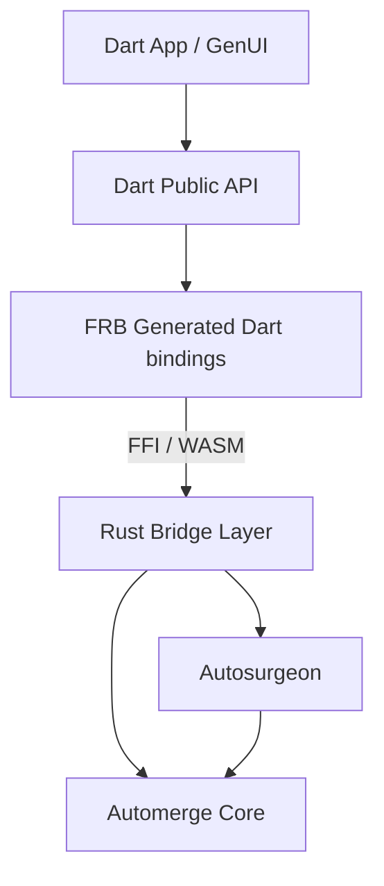

# Dart Automerge Package Design

## 1. Overview

This package, `dart_automerge`, provides a high-performance, idiomatic Dart API for [Automerge](https://automerge.org/), a CRDT (Conflict-free Replicated Data Type) library.

The integration strategy relies on **Flutter Rust Bridge (FRB)** to interface with the robust **Rust** implementation of Automerge, and leverages **Autosurgeon** to simplify the complexity of data synchronization and patch application.

### Goals

- **Idiomatic Dart API**: Provide a Dart-friendly interface (Futures, Streams, strongly-typed getters where possible) rather than a raw FFI binding.
- **Performance**: Minimize FFI overhead by batching operations and using intelligent serialization strategies (like Autosurgeon's reconciliation).
- **Cross-Platform**: Support all Flutter platforms (Mobile, Desktop) and Web (via WASM).
- **Sync Compatibility**: Full compatibility with the standard Automerge sync protocol.

## 2. Architecture

The package is layered as follows:



### 2.1 Dart Public API (`lib/`)

The consumer-facing layer. It wraps the low-level FRB generated code in comfortable Dart classes (`Doc`, `Transaction`, `SyncState`). It handles:

- Resource management (closing handles).
- Stream transformation (converting Rust events to Dart streams).
- Error handling customization.

### 2.2 Rust Bridge Layer (`rust/src/api/`)

The interface exposed to Dart. Defined in Rust, but shaped for Dart consumption.

- **State Management**: Holds `Arc<Mutex<automerge::Automerge>>` instances.
- **Reconciliation**: Uses `autosurgeon::reconcile` to apply changes from Dart (passed as JSON-like structures or specific structs) into the Automerge document.
- **Hydration**: Uses `autosurgeon::hydrate` to efficiently extract data from the document to send back to Dart.

## 3. Data Strategy: The "JSON Profile"

Since Dart is dynamic and Automerge is schema-less (but structural), and `genui` heavily relies on JSON-like structures, the primary interface for this library will be **JSON-centric**.

We will use **Autosurgeon** to `reconcile` a Rust `serde_json::Value` into the Automerge document. This allows Dart to pass a `Map<String, dynamic>` or `List<dynamic>`, have it serialized to a minimal binary form (or direct structural mapping via FRB), and then reconciled into the CRDT.

- **Writes**: Dart sends a JSON object → Rust deserializes to `serde_json::Value` → `autosurgeon::reconcile` updates the Doc.
- **Reads**: Rust calls `autosurgeon::hydrate` → serializes to JSON/BSON → Dart reconstructs `Map`/`List`.

## 4. API Design

### 4.1 The `Doc` Class

Represents a single Automerge document.

```dart
class Doc {
  /// Creates a new, empty document.
  static Future<Doc> newDoc();

  /// Loads a document from a binary byte array (automerge.save() format).
  static Future<Doc> load(Uint8List call);

  /// Gets the current state of the document as a plain Dart object (Map/List).
  ///
  /// This typically calls `hydrate` in Rust.
  Future<dynamic> get value;

  /// Updates the document by providing a callback that modifies the logical state.
  ///
  /// The [handler] receives the current state. The return value of [handler]
  /// is reconciled into the document.
  Future<void> update(Future<dynamic> Function(dynamic current) handler);

  /// Directly reconciles a new value into the document root.
  Future<void> reconcile(dynamic newValue);

  /// Serializes the document to a byte array.
  Future<Uint8List> save();

  /// Forks the document at the current head.
  Future<Doc> fork();

  /// Merges another document into this one.
  Future<void> merge(Doc other);

  /// Stream of changes (patches) occurring on this document.
  Stream<List<Patch>> get patches;
}
```

### 4.2 Synchronization

We will expose the standard Automerge Sync Protocol mechanisms to allow integration with any transport (WebSocket, standard HTTP, etc.).

```dart
class SyncState {
  /// Create a new sync state tracker.
  static Future<SyncState> create();

  /// Decodes a sync message to see what heads it contains/needs.
  Future<void> decodeMessage(Uint8List message);
}

extension DocSync on Doc {
  /// Generates a sync message to send to a peer.
  ///
  /// [syncState] tracks what we think the peer has.
  Future<Uint8List?> generateSyncMessage(SyncState syncState);

  /// Receives a sync message from a peer and applies it.
  ///
  /// Updates [syncState] with the peer's new status.
  Future<void> receiveSyncMessage(SyncState syncState, Uint8List message);
}
```

## 5. Implementation Plan

### 5.1 Rust Structs

We won't necessarily define structs for _User Data_ (since it's dynamic), but we will define structs for the _API handles_.

```rust
// rust/src/api/doc.rs

pub struct DocHandle {
    // Encapsulated in a mutex for thread safety
    inner: RustAutoOpaque<Arc<Mutex<automerge::Automerge>>>,
}

impl DocHandle {
    pub fn new() -> Self { ... }

    // Uses serde_json to bridge the dynamic gap
    pub fn reconcile_json(&self, json_str: String) -> Result<()> {
        let mut doc = self.inner.lock();
        let val: serde_json::Value = serde_json::from_str(&json_str)?;
        let mut txn = doc.transaction();
        autosurgeon::reconcile(&mut txn, &val)?;
        txn.commit();
        Ok(())
    }

    pub fn hydrate_json(&self) -> Result<String> {
        let doc = self.inner.lock();
        let val: serde_json::Value = autosurgeon::hydrate(&doc)?;
        Ok(val.to_string())
    }
}
```

_Note: We can optimize passing JSON strings by using something more binary efficient like BSON or MessagePack if performance becomes a bottleneck, or FRB's `DartDynamic` support if robust enough._

### 5.2 Flutter Rust Bridge Setup

- **Directory**: `packages/dart_automerge`
- **Command**: `flutter_rust_bridge_codegen create packages/dart_automerge --template plugin`
- Dependency versions should track the latest stable `automerge` and `autosurgeon`.

## 6. Future Considerations

### 6.1 Path-based Operations

While `reconcile` (replace whole/subtree) is powerful, sometimes we want to just "insert at index 5". We can expose specific `put(path, value)` or `insert(path, index, value)` methods that map to `transact` blocks in Rust using the Automerge API directly, bypassing Autosurgeon for fine-grained edits.

### 6.2 Text Editing

Automerge has specialized text handling (Peritext). Detailed text editing APIs should be exposed separately from the generic JSON value API to support rich-text collaboration use cases.

### 6.3 Actor IDs and History

- Expose `getActorId()` / `setActorId()`.
- Expose `getChanges()` / `applyChanges()` for file-based sync (ad-hoc replication).
- Expose `getHistory()` to inspect past states.
