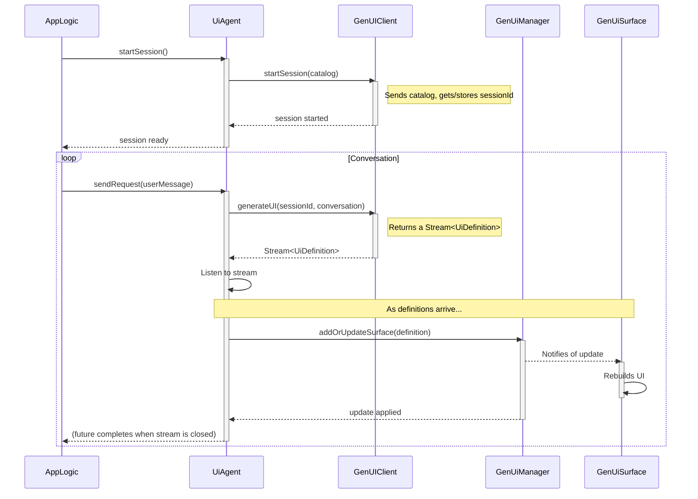

# `genui_client` Package Implementation

## Purpose

The `genui_client` package is a Flutter package that enables the creation of applications with dynamically generated user interfaces. It is responsible for defining the set of available UI components (the "catalog"), communicating with a `genui_server` backend, and rendering the UI definitions received from it.

## Architecture

The package provides the necessary components to manage the client-side of a GenUI application. The primary entry point for applications is the `UiAgent` facade.

### Core Components

1. **`Catalog`**: A collection of `CatalogItem`s. This is the cornerstone of the client's capabilities, defining every widget that the application knows how to render. The `Catalog` can be serialized to a JSON schema to be sent to the server.

2. **`GenUIClient`**: This class handles all network communication with the `genui_server`.

   - It manages the `sessionId` for the conversation.
   - **`startSession(Catalog catalog)`**: Performs the initial handshake.
   - **`generateUI(String sessionId, List<ChatMessage> conversation)`**: Returns a `Stream<UiDefinition>` from the server. The client listens to this stream to receive real-time UI updates.

3. **`GenUiManager`**: The client-side state manager for all dynamic UI surfaces. It implements the `SurfaceBuilder` interface and holds the `WidgetValueStore` to maintain the state of individual widgets (e.g., text field input).

4. **`UiAgent`**: A high-level facade and the primary entry point for the package. It simplifies the interaction with the various components by orchestrating the `GenUiManager` and `GenUIClient`.

5. **`GenUiSurface`**: A Flutter widget that listens to the `GenUiManager` (via the `SurfaceBuilder` interface) and recursively builds the Flutter widget tree from the UI definitions.

### UI Widgets

The package also provides high-level widgets to quickly build chat-based UIs.

1. **`GenUiChat`**: A complete chat widget that integrates with a `UiAgent` to provide a user interface for sending messages and displaying conversation history, including rendered UI surfaces from the AI.

2. **`ConversationWidget`**: A widget that displays the conversation history from a `UiAgent`, but without the input box, giving more control over the UI.

3. **`ChatBox`**: A widget that provides a text input field for a chat interface.

## Data Flow

The client drives the conversation and reacts to a stream of UI updates from the server, orchestrated by the `UiAgent`.

1. **Initialization & Handshake**: The application creates a `UiAgent` and calls `startSession()`. The agent then uses its internal `GenUIClient` to send the catalog to the server and receive a `sessionId`.
2. **User Interaction**: The user provides input (e.g., through a chat interface).
3. **API Call**: The app logic calls `uiAgent.sendRequest(userMessage)`.
4. **Streaming Request**: The `UiAgent` calls `genUIClient.generateUI`, which makes the HTTP request and returns a `Stream<UiDefinition>`.
5. **Processing Stream**: The `UiAgent` listens to the stream. As each `UiDefinition` arrives, it calls `genUiManager.addOrUpdateSurface(...)`.
6. **Rendering**: The `GenUiManager` notifies the appropriate `GenUiSurface` widget, which rebuilds to show the latest changes in real-time.

