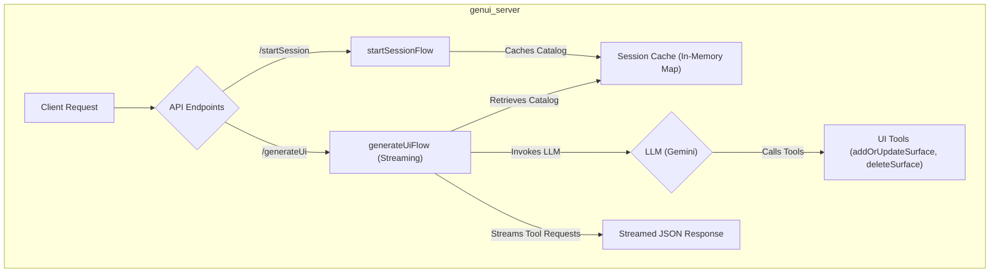
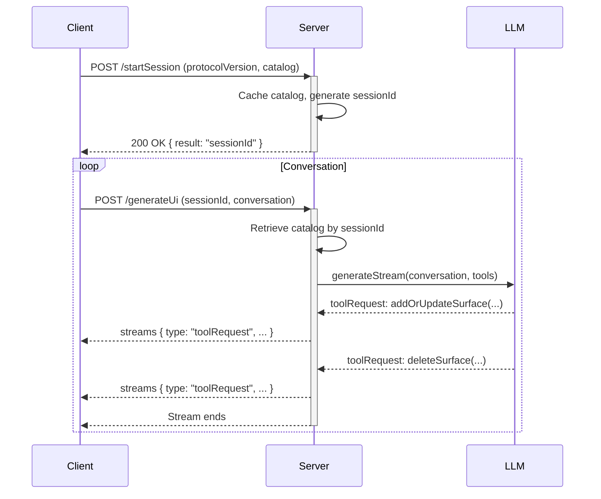

# `genui_server` Package Implementation

## Purpose

The `genui_server` package is the server-side component of the GenUI framework. Its primary responsibility is to interact with a Large Language Model (LLM) to generate dynamic UI definitions based on a conversation history and a client-provided widget catalog. It is designed to be a stateless, scalable, and secure backend for any GenUI-compatible client.

## Architecture

The server is built using the Genkit framework in TypeScript and managed with the `pnpm` package manager.



### Core Components

1. **Genkit Framework**: The foundation of the server, providing tools for creating AI flows, managing models, and defining tools.
2. **TypeScript**: The language for implementation, providing type safety.
3. **pnpm**: For efficient and deterministic package management.
4. **Zod**: For defining the schemas for API inputs.
5. **Session Cache**: A simple in-memory `Map` to store widget catalogs associated with session IDs.

## API Design

The server exposes two primary HTTP endpoints, each corresponding to a Genkit flow.

### 1. `POST /startSession`

This endpoint initializes a new session for a client and corresponds to the `startSessionFlow`.

- **Purpose**: To register a client's UI capabilities (its widget catalog) with the server and establish a session.
- **Request Body Schema** (`startSessionRequestSchema`):

  ```typescript
  z.object({
    protocolVersion: z.string(),
    catalog: z.any(),
  });
  ```

- **Response Body**: A JSON object containing the unique session identifier.

  ```json
  {
    "result": "unique-session-identifier"
  }
  ```

### 2. `POST /generateUi` (Streaming)

This endpoint generates UI updates in real-time for a given conversation and corresponds to the `generateUiFlow`.

- **Purpose**: To take the current conversation state and generate the next UI to be displayed, streaming tool calls as they are produced by the LLM.
- **Request Body Schema** (`generateUiRequestSchema`):

  ```typescript
  z.object({
    sessionId: z.string(),
    conversation: z.array(z.any()),
  });
  ```

- **Response Body**: A stream of JSON objects. The server yields a chunk for each tool call requested by the LLM.

  ```json
  // Example of a streamed chunk
  {
    "type": "toolRequest",
    "toolRequests": [
      {
        "name": "addOrUpdateSurface",
        "input": {
          "surfaceId": "some-surface",
          "definition": { ... }
        }
      }
    ]
  }
  ```

- **Logic**:
  1. The flow is a **streaming Genkit flow**.
  2. It retrieves the `catalog` from the in-memory session cache using the `sessionId`.
  3. It uses statically defined `addOrUpdateSurface` and `deleteSurface` Genkit tools.
  4. When the LLM calls one of these tools, the flow immediately `yield`s the `toolRequest` object as a chunk in the response stream.
  5. The client is responsible for interpreting these tool requests and updating its UI accordingly.

## Data Flow

The following diagram illustrates the sequence of interactions, including the streaming response.


