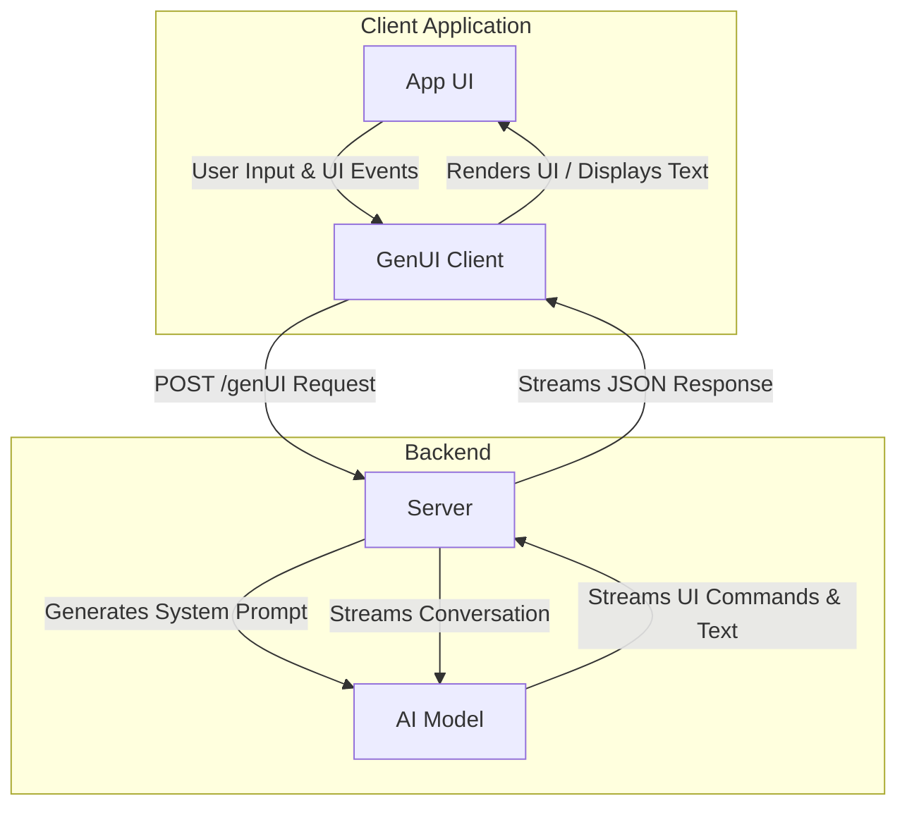
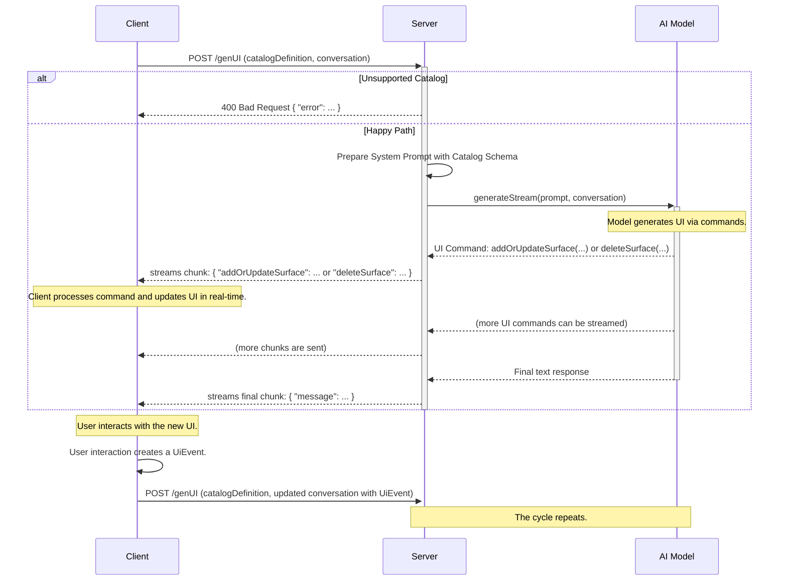

# GenUI Client-Server Communication Protocol v1.0

This document outlines the JSON-based wire format for **v1.0** of the GenUI protocol. The protocol is designed to facilitate real-time, AI-driven user interface generation over a streaming HTTP connection.

## Architecture Overview

The communication model involves a client application, a server that orchestrates AI interactions, and an AI model that generates UI definitions and text responses from a given catalog of client-available widgets.



## Communication Flow

The interaction is stateful on the client and stateless on the server. The client maintains the full conversation history and sends it, along with the client-available catalog with every request. The server processes the request, interacts with the AI model, and streams back responses. The client can refer to a predefined catalog and version that it supports, and augment that catalog with local widgets.



## Endpoint: `POST /genUI`

This is the sole endpoint for all communication.

- **URL**: `/genUI`
- **Method**: `POST`
- **Query Parameters**:
  - `stream=true`: (Required) Indicates that the client expects a streaming response.
- **Content-Type**: `application/json`

---

## Request Body Format

The body of the `POST` request is a JSON object containing the client's UI capabilities and the complete conversation history.

### Top-Level Request Schema

```json
{
  "$schema": "http://json-schema.org/draft-07/schema#",
  "type": "object",
  "properties": {
    "catalogDefinition": {
      "description": "Defines the protocol version and the UI widget catalog to be used.",
      "$ref": "#/definitions/CatalogDefinition"
    },
    "conversation": {
      "description": "An array of messages representing the conversation history.",
      "type": "array",
      "items": {
        "$ref": "#/definitions/GenuiClientMessage"
      }
    }
  },
  "required": ["catalogDefinition", "conversation"],
  "definitions": {
    "CatalogDefinition": {
        "type": "object",
        "properties": {
            "protocolVersion": {
                "description": "The version of the GenUI protocol being used.",
                "type": "string",
                "const": "1.0"
            },
            "baseCatalog": {
                "description": "A reference to a predefined, versioned catalog on the server.",
                "type": "object",
                "properties": {
                    "name": {
                        "description": "The name of the base catalog. For v1.0, only 'default' is supported.",
                        "type": "string"
                    },
                    "version": {
                        "description": "The version of the base catalog.",
                        "type": "string"
                    }
                },
                "required": ["name", "version"]
            },
            "augmentations": {
                "description": "A JSON schema for additional widgets that augment the base catalog.",
                "$ref": "#/definitions/JsonSchema"
            }
        },
        "required": ["protocolVersion"]
    },
    "JsonSchema": {
      "type": "object",
      "properties": {
        "description": { "type": "string" },
        "type": { "type": "string" },
        "properties": { "type": "object" },
        "required": { "type": "array", "items": { "type": "string" } },
        "items": { "$ref": "#/definitions/JsonSchema" },
        "anyOf": { "type": "array", "items": { "$ref": "#/definitions/JsonSchema" } }
      }
    },
    "GenuiClientMessage": {
      "type": "object",
      "properties": {
        "role": {
          "type": "string",
          "enum": ["user", "model"]
        },
        "parts": {
          "type": "array",
          "items": {
            "$ref": "#/definitions/MessagePart"
          }
        }
      },
      "required": ["role", "parts"]
    },
    "MessagePart": {
      "oneOf": [
        { "$ref": "#/definitions/TextPart" },
        { "$ref": "#/definitions/ImagePart" },
        { "$ref": "#/definitions/UiPart" },
        { "$ref": "#/definitions/UiEventPart" }
      ]
    },
    "TextPart": {
      "type": "object",
      "properties": {
        "type": { "const": "text" },
        "text": { "type": "string" }
      },
      "required": ["type", "text"]
    },
    "ImagePart": {
      "type": "object",
      "properties": {
        "type": { "const": "image" },
        "base64": { "type": "string" },
        "mimeType": { "type": "string" },
        "url": { "type": "string", "format": "uri" }
      },
      "required": ["type"]
    },
    "UiPart": {
      "type": "object",
      "properties": {
        "type": { "const": "ui" },
        "definition": { "$ref": "#/definitions/UiDefinition" }
      },
      "required": ["type", "definition"]
    },
    "UiEventPart": {
      "type": "object",
      "properties": {
        "type": { "const": "uiEvent" },
        "event": { "$ref": "#/definitions/UiEvent" }
      },
      "required": ["type", "event"]
    },
    "UiEvent": {
      "type": "object",
      "properties": {
        "surfaceId": { "type": "string" },
        "widgetId": { "type": "string" },
        "eventType": { "type": "string" },
        "isAction": { "type": "boolean" },
        "value": {},
        "timestamp": { "type": "string", "format": "date-time" }
      },
      "required": ["surfaceId", "widgetId", "eventType", "isAction", "timestamp"]
    },
    "UiDefinition": {
      "type": "object",
      "properties": {
        "surfaceId": { "type": "string" },
        "root": { "type": "string" },
        "widgets": {
          "type": "array",
          "items": { "type": "object" }
        }
      },
      "required": ["surfaceId", "root", "widgets"]
    }
  }
}
```

## Error Handling

### Unsupported Catalog Version

If the client requests a `baseCatalog` name or version that the server does not support, the server must immediately terminate the request with a `400 Bad Request` status code and a non-streaming JSON response body.

**Error Response Schema:**

```json
{
    "$schema": "http://json-schema.org/draft-07/schema#",
    "type": "object",
    "properties": {
        "error": {
            "type": "object",
            "properties": {
                "code": { "const": "unsupported_catalog_version" },
                "message": { "type": "string" },
                "supportedCatalogs": {
                    "type": "array",
                    "items": {
                        "type": "object",
                        "properties": {
                            "name": { "type": "string" },
                            "versions": {
                                "type": "array",
                                "items": { "type": "string" }
                            }
                        },
                        "required": ["name", "versions"]
                    }
                }
            },
            "required": ["code", "message", "supportedCatalogs"]
        }
    },
    "required": ["error"]
}
```

## Response Body Format

If the request is valid, the server sends a stream of newline-delimited JSON objects (JSONL). Clients should read the stream, split it by `\n`, and parse each non-empty line as a separate JSON object.

The stream can contain several types of objects, identified by their top-level key.

## Client-side History

To maintain a stateless server, the client is responsible for recording the conversation history. When the stream is complete (signaled by the final `message` chunk), the client **must** construct a `GenuiClientMessage` object to save in its history.

This historical message is created by combining two pieces of information:

1.  The final UI state, which the client has built by applying the `addOrUpdateSurface` and `deleteSurface` chunks. This becomes the `UiPart` of the message.
2.  The final text response from the server, which is the content of the final `message` chunk. This becomes the `TextPart` of the message.

This combined message is then included in the `conversation` array of the next request, providing the full context to the AI model.

### Stream Chunk Types

A given chunk will be one of the following:

1.  **UI Update (`addOrUpdateSurface`):** Adds or replaces a UI surface. This stream of updates is the **canonical source of truth** for the UI state.
2.  **UI Deletion (`deleteSurface`):** Removes a UI surface.
3.  **Text (`text`):** A piece of the model's text response. Multiple `text` chunks can be sent in a stream.
4.  **Final Message (`message`):** A final message containing only the complete text response. This signals the end of the response stream for this turn.

### `addOrUpdateSurface` Chunk

Adds a new UI surface or updates an existing one.

**Schema:**

```json
{
  "$schema": "http://json-schema.org/draft-07/schema#",
  "type": "object",
  "properties": {
    "addOrUpdateSurface": {
      "type": "object",
      "properties": {
        "surfaceId": {
          "type": "string",
          "description": "The unique ID for the UI surface."
        },
        "definition": {
          "description": "A JSON object that defines the UI surface. This must conform to the client's catalog schema.",
          "$ref": "#/definitions/UiDefinition"
        }
      },
      "required": ["surfaceId", "definition"]
    }
  },
  "required": ["addOrUpdateSurface"],
  "definitions": {
    "UiDefinition": {
      "type": "object",
      "properties": {
        "root": {
          "type": "string",
          "description": "The ID of the root widget in the UI tree."
        },
        "widgets": {
          "type": "array",
          "description": "A list of all the widget definitions for this UI surface.",
          "items": {
            "type": "object",
            "properties": {
              "id": { "type": "string", "description": "The unique ID for the widget." },
              "widget": { "type": "object", "description": "The widget definition." }
            },
            "required": ["id", "widget"]
          }
        }
      },
      "required": ["root", "widgets"]
    }
  }
}
```

### `deleteSurface` Chunk

Deletes a UI surface.

**Schema:**

```json
{
  "$schema": "http://json-schema.org/draft-07/schema#",
  "type": "object",
  "properties": {
    "deleteSurface": {
      "type": "object",
      "properties": {
        "surfaceId": {
          "type": "string",
          "description": "The unique ID for the UI surface to delete."
        }
      },
      "required": ["surfaceId"]
    }
  },
  "required": ["deleteSurface"]
}
```

### `text` Chunk

A part of the text response from the model.

**Schema:**

```json
{
  "$schema": "http://json-schema.org/draft-07/schema#",
  "type": "object",
  "properties": {
    "text": {
      "type": "string"
    }
  },
  "required": ["text"]
}
```

### `message` Chunk (Final)

The final message object for the model's turn, containing the complete and final text response. This indicates that the server has finished sending all information for the current request.

**Schema:**

```json
{
  "$schema": "http://json-schema.org/draft-07/schema#",
  "type": "object",
  "properties": {
    "message": {
      "$ref": "#/definitions/GenuiServerMessage"
    }
  },
  "required": ["message"],
  "definitions": {
    "GenuiServerMessage": {
      "type": "object",
      "properties": {
        "role": {
          "const": "model"
        },
        "parts": {
          "type": "array",
          "items": {
             "$ref": "#/definitions/TextPart"
          }
        }
      },
      "required": ["role", "parts"]
    },
    "TextPart": {
      "type": "object",
      "properties": {
        "type": { "const": "text" },
        "text": { "type": "string" }
      },
      "required": ["type", "text"]
    }
  }
}
```
