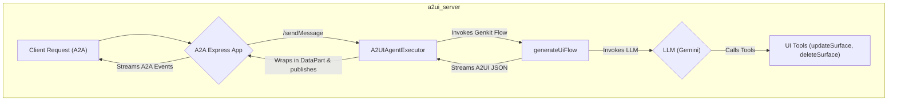
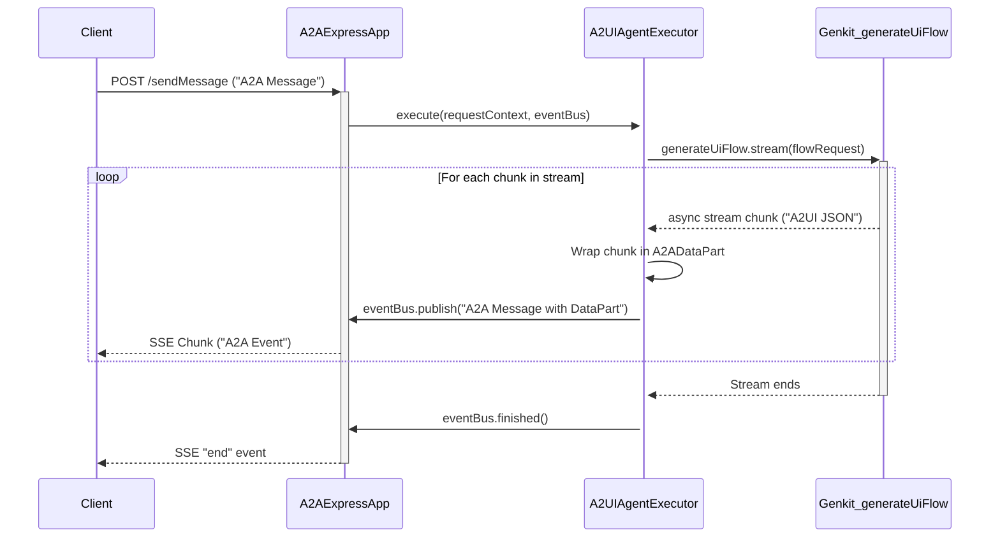

# `a2ui_server` Package Implementation

## Purpose

The `a2ui_server` package is the server-side component of the GenUI framework. Its primary responsibility is to interact with a Large Language Model (LLM) to generate dynamic UI definitions based on a conversation history. It exposes an A2A-compliant endpoint for clients to connect to.

## Getting Started

To run the server in development mode, use the following command:

```bash
pnpm run build-and-run
```

This will start the A2A server, which provides a local endpoint for the A2A protocol.

## Architecture

The server is built using the Genkit framework in TypeScript, with an `a2a-js` server handling the client communication. The server is managed with the `pnpm` package manager.



### Core Components

1.  **`a2a-js`**: The foundation of the server's communication layer, providing tools for creating A2A-compliant agents.
2.  **Genkit Framework**: The foundation of the UI generation logic, providing tools for creating AI flows, managing models, and defining tools. The Genkit configuration is located in `src/genkit.ts`.
3.  **TypeScript**: The language for implementation, providing type safety.
4.  **pnpm**: For efficient and deterministic package management.
5.  **Zod**: For defining the schemas for API inputs and tools.

## Schemas

The `src/schemas.ts` file defines the data structures used for the `generateUiFlow`. It uses Zod to create robust, validated schemas for:

- The widget catalog (`jsonSchema`).
- The conversation history, including different message parts like text, images, UI events, and UI definitions.
- The main request body for the `generateUi` flow (`generateUiRequestSchema`).

## API Design

The server exposes an A2A-compliant endpoint.

### A2A `sendMessage` (Streaming)

This endpoint generates UI updates in real-time for a given conversation.

- **Purpose**: To take the current conversation state and generate the next UI to be displayed, streaming A2A events as they are produced by the agent.
- **Request Body**: An A2A `sendMessage` request.
- **Response Body**: A stream of A2A events, including `message` events containing `data` parts with `a2uiMessages`.

- **Logic**:
  1.  The `A2UIAgentExecutor` receives the `sendMessage` request.
  2.  It extracts the user's prompt and calls the `generateUiFlow`.
  3.  The `generateUiFlow` is a **streaming Genkit flow** that uses `ai.generateStream`.
  4.  It dynamically constructs a **system prompt** using the `catalog` from the request. This prompt instructs the LLM on how to structure the UI definition to match the client's capabilities.
  5.  It uses two statically defined Genkit tools: `updateSurface` and `deleteSurface`, both with strict Zod schemas for their inputs.
  6.  It transforms the incoming conversation history into a format suitable for the LLM. Specifically, `uiEvent` parts are converted into a descriptive text block, informing the model about user interactions.
  7.  As the LLM generates content, the flow streams back chunks containing tool requests.
  8.  The flow transforms these tool requests into a specific A2UI protocol for the client:
      - An `updateSurface` tool call is split into two separate streamed messages: `surfaceUpdate` (containing the component definitions) and `beginRendering` (signaling the client to render the new UI tree).
      - A `deleteSurface` tool call is transformed into a single `deleteSurface` message.
  9.  The `A2UIAgentExecutor` wraps these A2UI messages in A2A `DataPart`s and publishes them on the `ExecutionEventBus`.
  10. The `A2AExpressApp` sends these events to the client as Server-Sent Events (SSE).

## Data Flow

The following diagram illustrates the sequence of interactions.



## Logging

The server uses the `pino` logger for structured logging. By default, logging is disabled. To enable it, set the `LOG_LEVEL` environment variable when running the server.

- **Example (Info Level)**: `LOG_LEVEL=info pnpm run build-and-run`
- **Example (Debug Level)**: `LOG_LEVEL=debug pnpm run build-and-run`

Supported log levels are: `fatal`, `error`, `warn`, `info`, `debug`, `trace`. In development, logs are automatically formatted for readability with `pino-pretty`.
