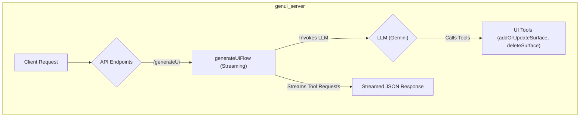
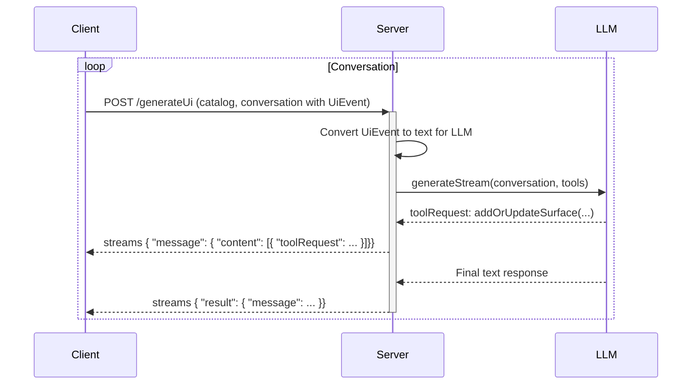

# `genui_server` Package Implementation

## Purpose

The `genui_server` package is the server-side component of the GenUI framework. Its primary responsibility is to interact with a Large Language Model (LLM) to generate dynamic UI definitions based on a conversation history and a client-provided widget catalog. It is designed to be a stateless, scalable, and secure backend for any GenUI-compatible client.

## Architecture

The server is built using the Genkit framework in TypeScript and managed with the `pnpm` package manager.



### Core Components

1.  **Genkit Framework**: The foundation of the server, providing tools for creating AI flows, managing models, and defining tools.
2.  **TypeScript**: The language for implementation, providing type safety.
3.  **pnpm**: For efficient and deterministic package management.
4.  **Zod**: For defining the schemas for API inputs.

## API Design

The server exposes one primary HTTP endpoint, which corresponds to a Genkit flow.

### `POST /generateUi` (Streaming)

This endpoint generates UI updates in real-time for a given conversation and corresponds to the `generateUiFlow`.

- **Purpose**: To take the current conversation state and generate the next UI to be displayed, streaming tool calls as they are produced by the LLM.
- **Request Body Schema** (`generateUiRequestSchema`):

  ```typescript
  z.object({
    catalog: jsonSchema,
    conversation: z.array(messageSchema), // A schema for the conversation history
  });
  ```

- **Response Body**: A stream of JSON objects. The server yields a chunk for each tool call requested by the LLM, and a final message.

  ```json
  // Example of a streamed chunk
  data: {"message":{"role":"model","index":0,"content":[{"toolRequest":{...}}]}}

  // Example of a final message
  data: {"result":{"message":{...}}}
  ```

- **Logic**:
  1.  The flow is a **streaming Genkit flow**.
  2.  It uses the `catalog` from the request to generate a system prompt for the LLM.
  3.  It uses statically defined `addOrUpdateSurface` and `deleteSurface` Genkit tools with strict Zod schemas.
  4.  It transforms incoming `UiEventPart` messages into descriptive text for the LLM.
  5.  When the LLM calls one of these tools, the flow immediately `yield`s the `toolRequest` object as a chunk in the response stream.
  6.  The client is responsible for interpreting these tool requests and updating its UI accordingly.

## Data Flow

The following diagram illustrates the sequence of interactions, including the streaming response and UI events.

